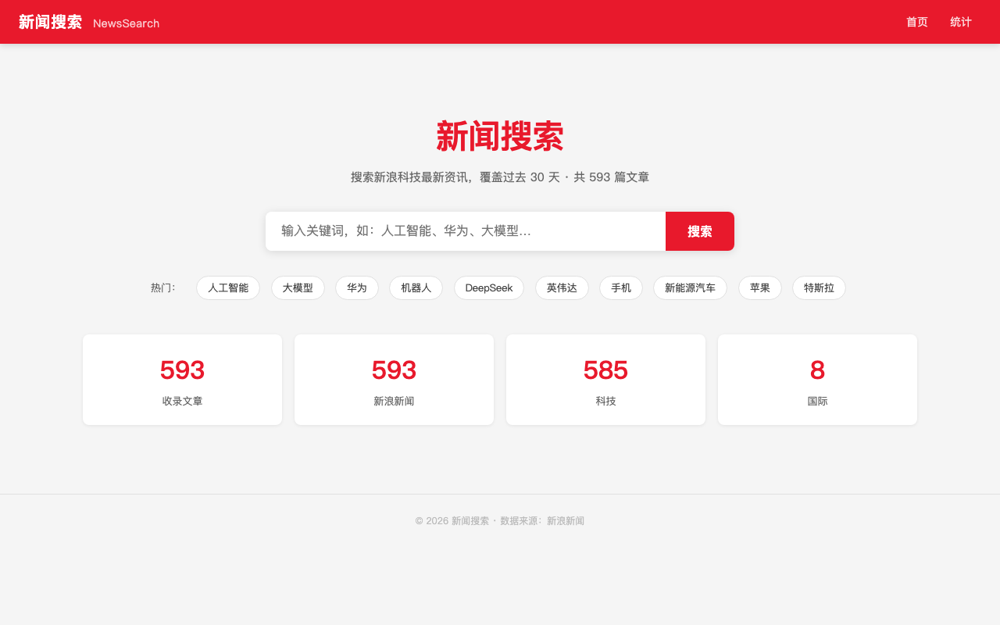
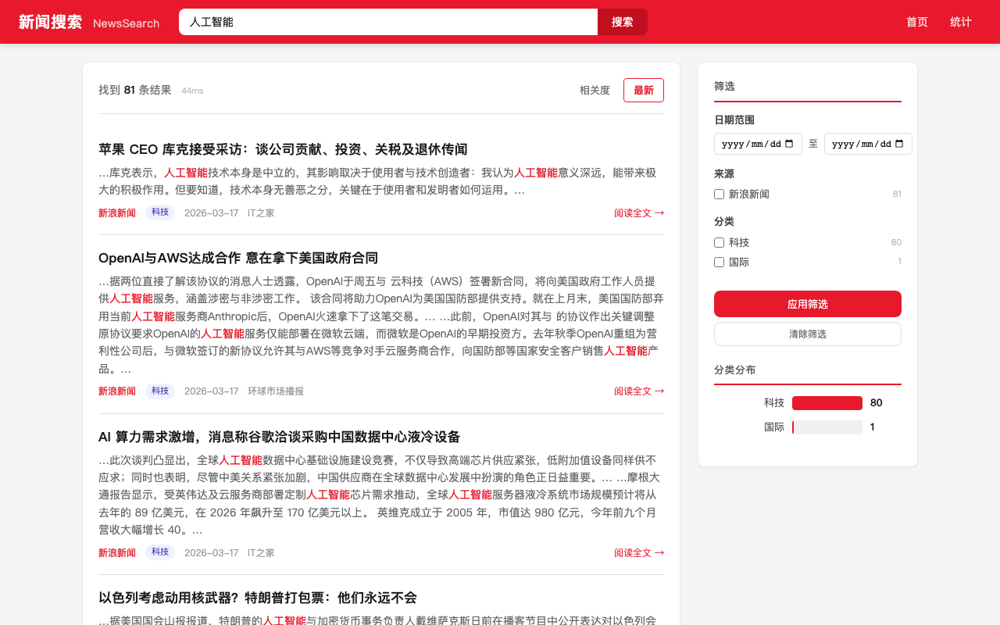
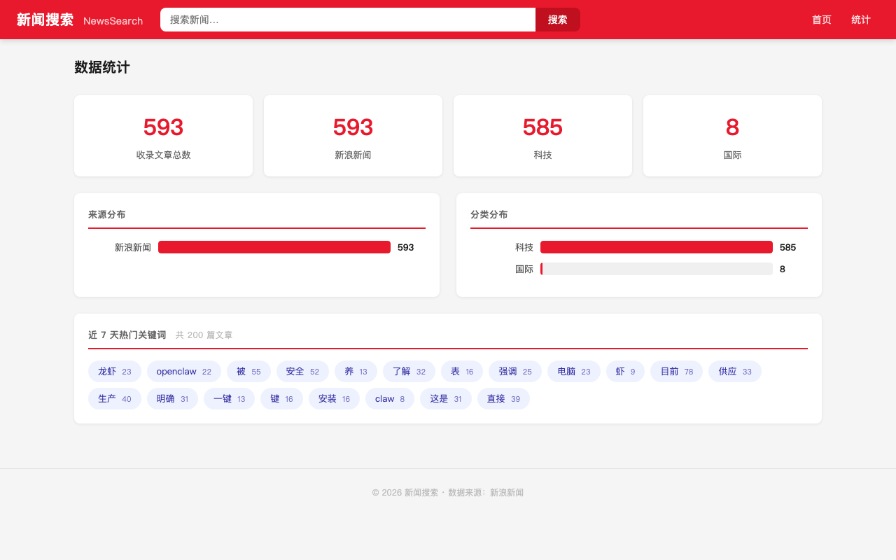

# News Crawler and Search System

A comprehensive news aggregation and search system for Chinese mainstream news websites (Sina, NetEase, Tencent News).

## Screenshots

### Homepage


### Search Results


### Article Detail


### Statistics


## Features

- 🕷️ Automated web crawling from multiple Chinese news sources
- 🔍 Full-text search with Chinese language support (Elasticsearch + IK Analysis)
- 🚀 RESTful API with FastAPI
- 🌐 Web frontend with Flask (search UI, article detail, statistics)
- 📊 Deduplication and content quality control
- ⏰ Scheduled crawling with APScheduler
- 🐳 Docker containerization for easy deployment

## Technology Stack

- **Python 3.11+**
- **Scrapy** - Web crawling framework
- **Elasticsearch 8.12** - Storage and search engine
- **FastAPI** - REST API framework
- **Flask** - Web frontend
- **Jieba** - Chinese text segmentation
- **Docker** - Containerization

## Quick Start

### 1. Prerequisites

- Python 3.11+
- Docker and Docker Compose
- Git

### 2. Installation

```bash
# Clone the repository
git clone <repository-url>
cd crawler

# Create virtual environment
python3 -m venv venv
source venv/bin/activate  # On Windows: venv\Scripts\activate

# Install dependencies
pip install -r requirements.txt

# Copy environment configuration
cp .env.example .env
# Edit .env with your settings
```

### 3. Start Elasticsearch

```bash
# Start Elasticsearch and Kibana
docker-compose up -d

# Wait for Elasticsearch to be ready
curl -X GET "localhost:9200/_cluster/health?wait_for_status=yellow&timeout=50s"

# Install IK Analysis plugin for Chinese text
docker exec -it news-crawler-elasticsearch /usr/share/elasticsearch/bin/elasticsearch-plugin install https://release.infinilabs.com/analysis-ik/stable/elasticsearch-analysis-ik-8.12.0.zip

# Restart Elasticsearch
docker restart news-crawler-elasticsearch

# Initialize the index
python scripts/init_elasticsearch.py
```

### 4. Run the Crawler

```bash
# Fetch article URLs for the past 30 days (step 1)
python scripts/fetch_tech_urls.py --days 30 --output tech_urls.json

# Crawl article content and index into Elasticsearch (step 2)
python scripts/run_crawler.py --spider url_list

# Or crawl Sina news homepage directly
python scripts/run_crawler.py --spider sina
```

### 5. Start the API Server

```bash
# Run the FastAPI server (port 8000)
uvicorn api.main:app --host 0.0.0.0 --port 8000 --reload

# Access the API documentation
# Open http://localhost:8000/docs in your browser
```

### 6. Start the Web Frontend

```bash
# Run the Flask frontend (port 5001)
python web/app.py

# Open in browser
# http://localhost:5001
```

### 7. Start the Scheduler (Optional)

```bash
# Run the scheduler for automated crawling
python scheduler/scheduler.py
```

## Project Structure

```
crawler/
├── config/              # Configuration management
├── crawler/             # Scrapy spiders and crawling logic
│   ├── spiders/        # Site-specific spiders
│   ├── items.py        # Data models
│   ├── pipelines.py    # Data processing pipelines
│   └── middlewares.py  # Custom middlewares
├── storage/             # Elasticsearch integration
├── api/                 # FastAPI REST API
│   └── routers/        # API endpoints
├── web/                 # Flask web frontend
│   ├── app.py          # Flask application
│   └── templates/      # Jinja2 HTML templates
├── processing/          # Text processing utilities
├── scheduler/           # Scheduled crawling tasks
├── utils/              # Common utilities
├── tests/              # Test suites
└── scripts/            # Utility scripts
```

## API Endpoints

### Search Articles
```bash
POST /api/v1/search
{
  "query": "人工智能",
  "sources": ["sina", "netease"],
  "date_from": "2024-03-01",
  "page": 1,
  "page_size": 10
}
```

### Get Article by ID
```bash
GET /api/v1/articles/{article_id}
```

### Statistics
```bash
GET /api/v1/stats/sources
GET /api/v1/stats/categories
GET /api/v1/stats/trending
```

### Health Check
```bash
GET /api/v1/health
```

## Testing

```bash
# Run all tests
pytest

# Run with coverage
pytest --cov=. --cov-report=html

# Run specific test file
pytest tests/test_spiders/test_sina_spider.py
```

## Development

### Adding a New Spider

1. Create a new spider file in `crawler/spiders/`
2. Inherit from `BaseSpider`
3. Implement `parse()` and `parse_article()` methods
4. Register in `scheduler/tasks.py`

### Configuration

Edit `.env` file to customize:
- Elasticsearch connection
- API server settings
- Crawler behavior (delays, concurrency)
- Logging levels

## Deployment

### Using Docker Compose (Full Stack)

```bash
# Build and start all services
docker-compose up -d

# View logs
docker-compose logs -f

# Stop services
docker-compose down
```

## Troubleshooting

### Elasticsearch Connection Issues
- Check if Elasticsearch is running: `curl http://localhost:9200`
- Verify IK plugin is installed: `curl http://localhost:9200/_cat/plugins`

### Chinese Text Not Searchable
- Ensure IK Analysis plugin is installed
- Check index mapping: `curl http://localhost:9200/news_articles/_mapping`

### Crawler Getting Blocked
- Increase `DOWNLOAD_DELAY` in settings
- Enable user agent rotation
- Check site's robots.txt

## License

MIT

## Contributing

Contributions are welcome! Please feel free to submit a Pull Request.
